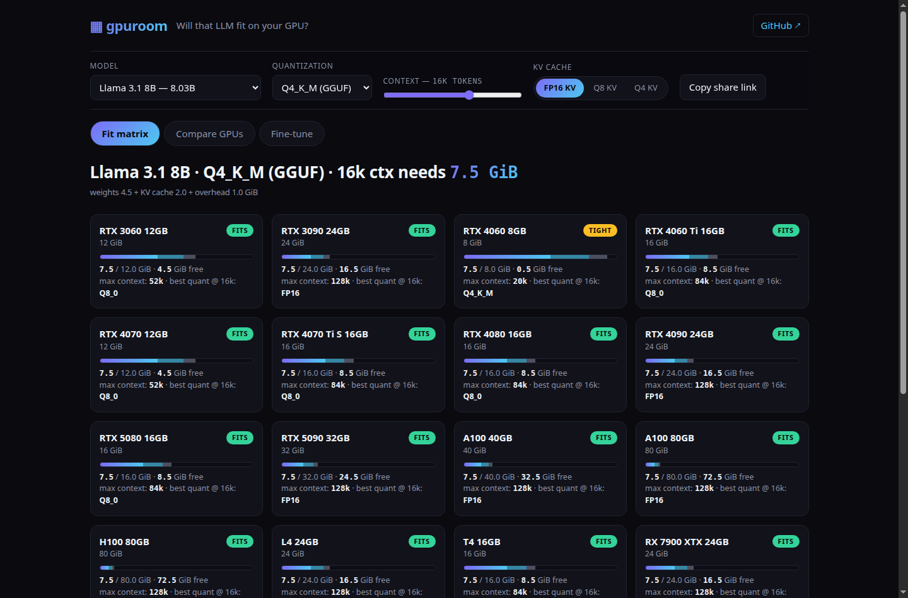
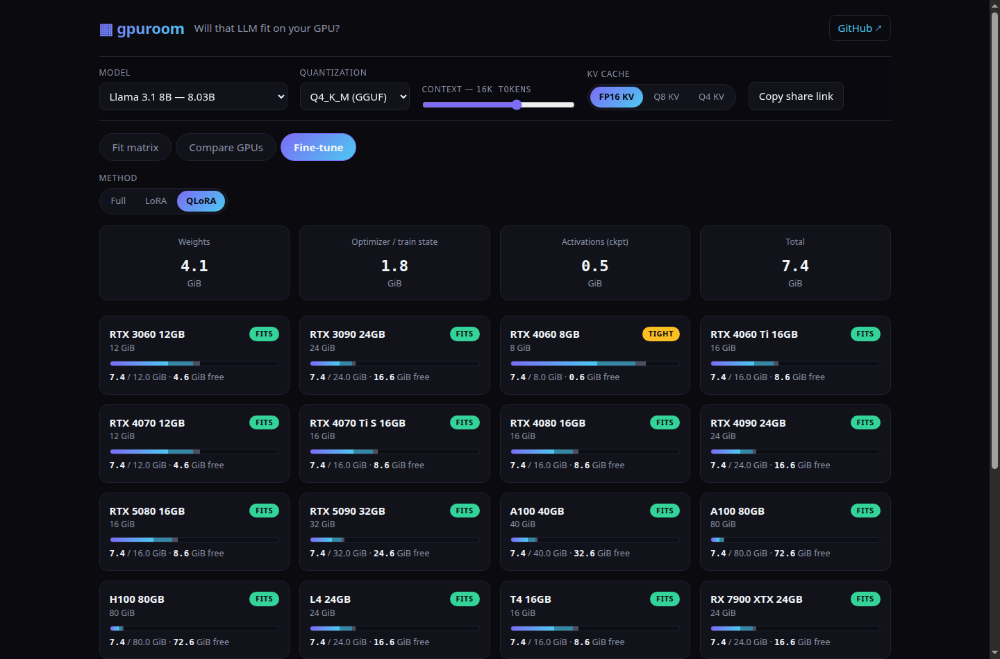
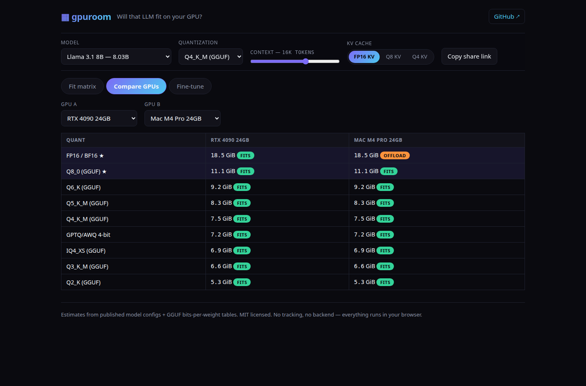

# gpuroom

**Will that LLM actually fit on your GPU? Find out in your browser — zero install, zero backend.**

[**▶ Live demo — gpuroom**](https://nguyenminhduc9988.github.io/gpuroom/) · quant-aware VRAM · KV-cache & context sliders · max-context finder · best-quant picker · multi-GPU compare · full/LoRA/QLoRA fine-tune calculator

[](LICENSE)


Type in a model and gpuroom tells you — instantly, for every GPU it knows — whether it fits, at which quantization, and how much context you can push before you run out of VRAM. It runs **entirely in your browser**: no CLI to install, no server, no telemetry, your queries never leave the tab.



## Why gpuroom

Most "will it fit" tools are a Rust or Python CLI you have to install, that print a single terminal table for one machine. gpuroom is a **shareable web app** that does the math for 21 GPUs at once, exposes the KV-cache and context tradeoffs the CLIs hide, and adds a fine-tuning memory planner they don't have at all.

| | Typical fit CLI (install-required) | **gpuroom** |
|---|---|---|
| Install | `cargo`/`pip` + binary | **None — open a URL** |
| Backend / telemetry | varies | **None. Fully client-side** |
| Output | one terminal table, one machine | **21-GPU fit matrix, live** |
| Quantizations | a few | **9** (FP16 → Q8_0, Q6_K, Q5_K_M, Q4_K_M, GPTQ4, IQ4_XS, Q3_K_M, Q2_K) |
| KV-cache math | hidden / fixed | **exposed — FP16/FP8/Q4 KV dtype toggle** |
| Context control | fixed | **log-scale slider, 512 → 1M tokens** |
| Max-context finder | ✗ | **✓ binary-search the largest context that fits** |
| Best-quant picker | ✗ | **✓ highest-quality quant that still fits your card** |
| Multi-GPU compare | ✗ | **✓ side-by-side any GPUs** |
| Fine-tune memory | ✗ | **✓ full / LoRA / QLoRA optimizer+gradient+activation estimate** |
| Shareable result | ✗ | **✓ full state encoded in the URL** |

## What it computes

- **Quant-aware weights** — real bits-per-weight per quant, not a flat ÷2. GGUF K-quants, GPTQ and IQ are all modelled.
- **KV cache** — from each model's real architecture (layers, KV heads, head dim, GQA), scaled by context length and KV dtype.
- **Inference footprint** — weights + KV + activation/CUDA-graph overhead → a fit verdict against each GPU's usable VRAM.
- **Max context** — binary-searches the largest context length that still fits a given GPU + quant.
- **Best quant** — the highest-quality quantization that fits, per card.
- **Fine-tuning** — full vs LoRA vs QLoRA: base weights + optimizer states + gradients + activations, so you know if that 4090 can actually *train*, not just infer.




## Catalog

- **16 models** with real HuggingFace-config architecture — Llama 3.1/3.2/3.3, the Qwen2.5 family + QwQ-32B, Mistral-7B, Mixtral-8x7B, Gemma 2 (9B/27B), Phi-4, and DeepSeek-R1 distills. Layers, KV heads, head dim and hidden size are the actual published values, so the KV math is correct rather than a guess.
- **21 GPUs** — RTX 3060 12GB through 4090, workstation and datacenter cards, plus Apple-silicon unified-memory caps.

## Run it locally

It's a static site — no build step.

```bash
git clone https://github.com/nguyenminhduc9988/gpuroom
cd gpuroom
python3 -m http.server 8000   # then open http://localhost:8000
```

The math engine is a standalone ES module (`js/engine.js`) with zero dependencies, so you can import it directly:

```js
import { fitVerdict, maxContext, bestQuant } from "./js/engine.js";
import { MODELS, GPUS } from "./data/catalog.js";
```

## Tests

```bash
npm test   # 15 tests — weights, KV cache, fit verdicts, max-context, best-quant, fine-tune, catalog sanity
```

## License

MIT — see [LICENSE](LICENSE). gpuroom is an independent, clean-room tool; it is not affiliated with any model or GPU vendor. Estimates are planning guidance — real usage varies with runtime, batch size and framework overhead.
